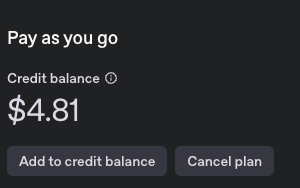

# 끝말잇기 LLM

## Run ( use Docker ... )

```sh
    // swagger
    swag fmt
    swag init

    // execute
    make run
    or
    docker-compose up --build -d
```

## API

- http://localhost:3000/swagger

```sh
    http://localhost:3000/ping
    http://localhost:3000/api/session // 세션 시작
    http://localhost:3000/api/play    // 끝말잇기 시작
```

## PG Table

```sql
CREATE EXTENSION IF NOT EXISTS vector;

CREATE TABLE sessions (
    id SERIAL PRIMARY KEY,
    created_at TIMESTAMP DEFAULT now()
);

CREATE TABLE words (
    id SERIAL PRIMARY KEY,
    session_id INT REFERENCES sessions(id) ON DELETE CASCADE,
    word TEXT NOT NULL,
    created_at TIMESTAMP DEFAULT NOW(),  -- 자동으로 현재 시간 저장
    embedding VECTOR(1536),  -- OpenAI 임베딩 크기
    UNIQUE(session_id, word) -- 같은 세션에서는 중복 불가
);
```

## Result

- <b>0.19 $ 사용 함 ... 비싼듯?</b>


